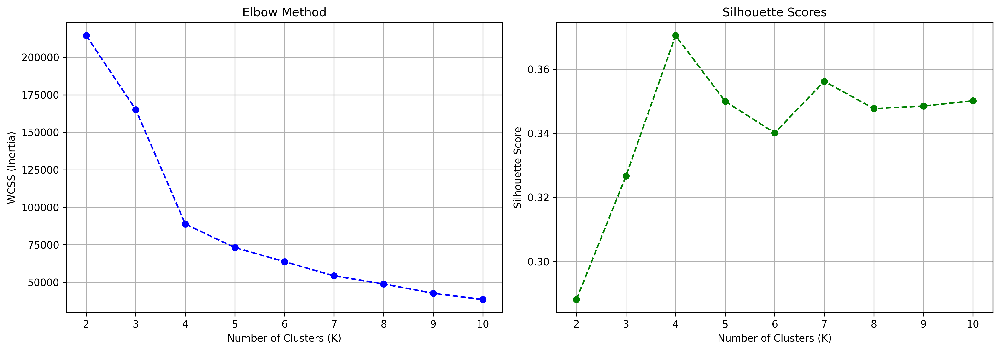
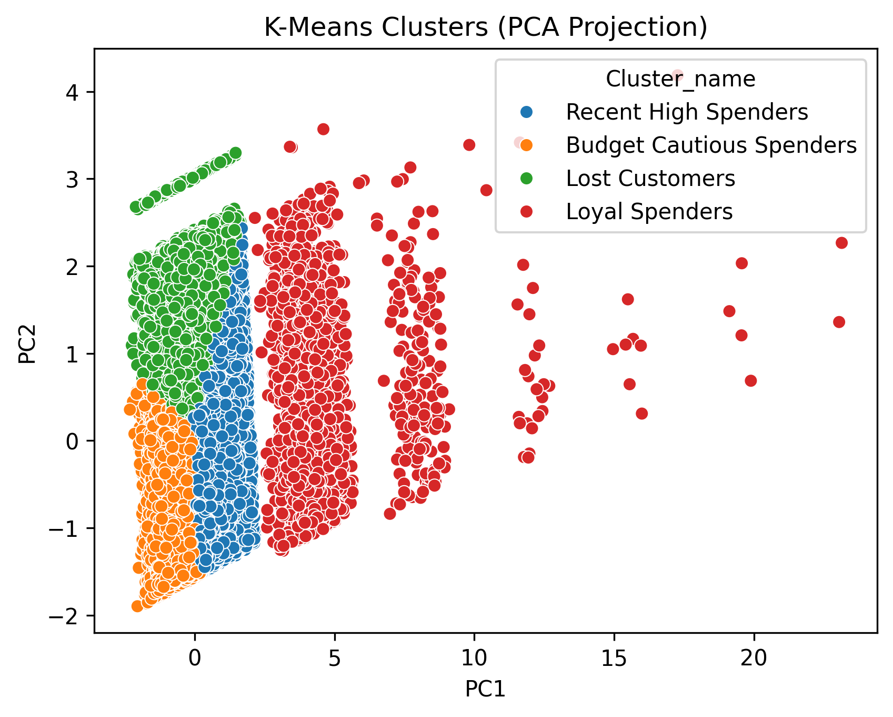

RFM Customer Segmentation of 93,000 Olist customers using KMeans clustering, identifying 4 distinct behavioral segments.

Data Provided by OLIST kaggle dataset found here: https://www.kaggle.com/datasets/olistbr/brazilian-ecommerce/data?select=olist_orders_dataset.csv

  ## Purpose
- Create an unsupervised model correlating the Recency, Frequency, and Monetary value of customer transactions on OLIST, a Brazilian E-Commerce website.
- Using the Model, segment customers into distinct behavioral groups for improved targeted marketing strategies

  Libraries: pandas, numpy, scikit-learn, seaborn, matplotlib

  ## Procedure
- Convert data to a complete RFM table with each customer unique ID
- Drop unneeded columns, remove outliers for KMeans, and log transform any necessary columns
- KMeans chosen as clustering algorithm, well-suited for relatively defined, spherical shapes shown in PCA projection.
- Calibrate model using the Elbow method and Silhouette score. Choosing the max Silhouette score and when the bend in Elbow method appears.
- Run model on data and project data onto a 2d graph. Cluster using Kmeans.
- Use PCA variance ratio to determine how the RFM is graphed in the x and y axes
- Interpret data and label clusters accordingly.

  ## Results

  

  
A peak of .37 was found at 4 clusters. This is further emphasized by the bend in the WCSS graph being shown at around 4 clusters.

                                               Recency  Frequency  Monetary_log
                                          PC1   -0.137      0.702         0.699
                                          PC2    0.990      0.073         0.121

- It can be seen that the graph favors frequency and monetary for PC1 (x-axis), whereas recency is favored in PC2 (y-axis).
- Indicates that in the graph, data points further right spend more and buy more frequently. Whereas further up shows people who have more recently bought.

                                        Recency  Frequency  Monetary  Count                 Segment
                              Cluster                                                           
                              0         292.81        1.0    262.09  29390     Recent High Spenders
                              1         272.53        1.0     65.63  33859 Budget Cautious Spenders
                              2         550.08        1.0    119.11  26440           Lost Customers
                              3         343.58        2.1    274.82   2733           Loyal Spenders

  

- Cluster 0 shows a group of recent spenders that have a high monetary budget. labeling these people as "Recent High Spenders"
- Cluster 1 shows a group that spends much less than their cluster 0 counterparts. labeling these as "Budget Cautious Spenders"
- Cluster 2 shows Customers who have not used OLIST in a long time. Labeling these "Lost Customers"
- Cluster 3 shows by far the fewest people but also the most frequent users. With an average recency between cluster 0 and cluster 2, these people are labeled "Loyal Spenders"
- Cluster 3 also shows bands of separation within the cluster. This can further be clustered down, most likely indicating how frequency affects the placement; high frequencies being further.
  
  ## Applications of Findings
###Cluster 0 (Recent High Spenders) ->
- A Retention campaign on premium products.
- People in this group have budget to spend on quality goods.
  
### Cluster 1 (Budget Cautious Spenders) ->
- More frequent emails.
- Deals may be important as these people could have a budget.
- Many people, so even a small conversion rate would help.
  
### Cluster 2 (Lost Customers) ->
- Either cut off or win back with new deals or recommended goods.
- Customers over the average 550 days, should be cut off. Attempting a win back campaign below 550 days would be risky but could have great results due to how many there are.

### Cluster 3 (Loyal Spenders) -> 
- Very important.
- Keep using loyalty points, early access to products, and personalized recommendations.
- Even though this is the smallest group, protecting them should be a high priority.
